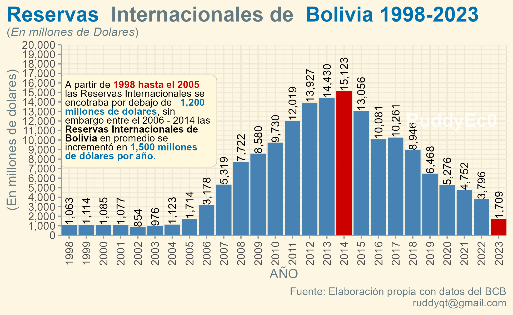

```{r setup, include=FALSE}
knitr::opts_chunk$set(echo = FALSE)
```

# Análisis de las Reservas Internacionales de Bolivia

Según el [__Banco Central de Bolivia__  ](chrome-extension://efaidnbmnnnibpcajpcglclefindmkaj/https://www.bcb.gob.bo/webdocs/ReservasInternacionales/ODOC-BoletinN160-jul07-Las_Reservas_Internacionales_del_BCB.pdf) las reservas internacionales son _activos líquidos internacionalmente aceptados como medio de pago, constituidos generalmente en oro, divisas (billetes y monedas, depósitos a la vista, depósitos a plazo y títulos valor)_, cuya administración y control legal recae en la autoridad monetaria en el caso de Bolivia en el Banco Central.  




A partir del año 2005 gran parte de las economías del mundo experimentaron un incremento significativo en las reservas internacionales incluyendo los países emergentes de América Latina. Este aumento importante obedeció básicamente al contexto favorable.

A partir del 2006 hasta el 2014 las Reservas Internacionales de Bolivia en promedio se incrementó en 1,500 millones de dólares por año, este comportamiento creciente entre el 2006-2014, es debido a los ingresos provenientes de las exportaciones de YPFB, alcanzando a registrar su máximo nivel el 2014, 15,123 millones de dólares. 

A partir del 2015 las Reservas Internacionales tiende a la baja, principalmente por el descenso de ingresos por las ventas de gas natural a Brasil y Argentina, a causa de una baja en la producción y por falta de exploración, disminuyendo en promedio 1,300 millones de dólares por año, el 2023 Bolivia cierra con 1,709 millones dólares, reduciendo en 79% entre el 1015 y 2023, de los cuales, el oro es 1,576 y el resto que se materializa en divisas alcanza los 166 millones de dólares.


# Grafica de las Reservas Internacionales

## 1. Packages a necesitar

Para comenzar, necesitamos cargar los siguientes packages:


```{r  eval=TRUE, echo=TRUE}
library(openxlsx) # Para importar / exportar excel 
library(magrittr) # Pipe
library(tidyverse) # Manipulacion de Datos
library(readxl)
library(tidyverse)   ##  (incl. the ggplot2 package)
library(systemfonts) ## fuentes personalizadas (deben estar instaladas en su sistema operativo)
library(scico)       ## c) in R 
library(ggtext)      ## agregar representación de texto mejorada a ggplot2
library(ggforce)     ## agrega funcines faltante a ggplot2
library(ggdist)      ## agregar visualizaciones de incertidumbre a ggplot2
library(magick)      ## cargar imágenes en R
library(patchwork)   ## combinar salidas de ggplot2
library(tinter)      ## tinter proporciona una forma sencilla de generar paletas monocromáticas
library(ggthemes)    ## El paquete ggthemes proporciona temas, geoms y escalas adicionales para el paquete ggplot2
library(ggcharts)    ## proporciona una interfaz de alto nivel {ggplot2}para crear gráficos comunes.
library(scales)      ##  crea guías (leyendas y ejes) que puedan usarse para leer el gráfico
```


```{r  eval=TRUE, echo=FALSE}
library(flextable)
library(knitr)
library(kableExtra)
```


```{r }

data_RIN_2023 <- read_excel("E:/01-PROYECTOS/00-1 TRABAJO DE INVESTIGACION EEB. BCB-1/data_RIN_2023.xlsx")

```
## 2. Datos de las Reservas Internacionales

Observemos la base de datos de las Reservas Internacionales extraído del BCB en millones de dólares desde el 1998-2023.Observemos la base de datos de las Reservas Internacionales extraído del BCB en millones de dólares desde el 1998-2023.

```{r table1, echo=FALSE}
flextable(data_RIN_2023)%>%
fix_border_issues(part = "all") %>%
  bold(part = "header")%>%
  add_footer_lines("Elavoracion propia con datos del BCB.")

```
## 3. Creamos una variable (tohighlight)
Una vez cargado los paquetes y datos iniciamos a crear una nueva variable  con la función **mutate()**, creamos la variable **tohighlight**, por su importancia resaltaremos las gestiones **(2014)** y **(2023)**, para diferenciar de las demás gestiones. 


```{r eval=TRUE, echo=TRUE}

X <- data_RIN_2023 %>% mutate(tohighlight = ifelse(AÑO == 2014 | AÑO == 2023, "yes", "no"))
```
Una vez modificado nuestra base de datos se tiene:


```{r}
flextable(X)%>%
fix_border_issues(part = "all") %>%
  bold(part = "header") %>%
  style(i = 17, 
        pr_t = fp_text_default(
          italic = TRUE, 
          color = "red"))%>%
  style(i = 26, 
        pr_t = fp_text_default(
          italic = TRUE, 
          color = "red"))%>%
  add_footer_lines("Elavoracion propia con datos del BCB.")
  
#  set_caption("a *weird* table summary")
 
```
## 3. Gráfico Simple con ggplot2

Con las modificaciones realizadas, realizamos un gráfico simple con **ggplo2**.


```{r figure, echo=TRUE, warning=FALSE, message=FALSE, fig.align='center'}

res<- ggplot( X, aes( x = AÑO, y = RIN, fill = tohighlight))+
  geom_bar(stat = "identity")
res
##ggsave("reser_int2023.pdf", width = 13, height = 6, device = cairo_pdf)
#geom_rect(xmin=1997, xmax=2005, ymin=-Inf, ymax=5000,  fill="cornsilk3", color=NA)+ 
```

## 4. Grafico final 

Para mejorar el grafico anterior, se modificara los colores de las barras con **scale_fill_manual()**, asi mismo  modificaremos los ejes con **scale_y_continuous()** y **scale_x_continuous()** para el  eje (y)  y (x).

Los cuadros de texto se pueden crear con **element_textbox()** o **element_textbox_simple()**. Los cuadros de texto se diferencian de las etiquetas creadas con **element_markdown()** que tienden a tener un ancho específico y envuelven su contenido para que se ajuste a ese ancho. 

La altura de un cuadro de texto normalmente se calcula automáticamente para que coincida con la altura del contenido, pero también es posible establecer la altura explícitamente.


```{r figure1, echo=TRUE, warning=FALSE, message=FALSE, fig.align='center'}
   res1<- ggplot( X, aes( x = AÑO, y = RIN, fill = tohighlight))+
  geom_bar(stat = "identity") +
  scale_fill_manual( values = c( "yes"="#CD0000", "no"="#4682B4" ), guide = FALSE )+
    scale_y_continuous(label = comma, breaks = seq(0, 20000, by = 1000),expand = c(0,0),limits = c(0,20000))+
    scale_x_continuous(expand = c(0,0),breaks=pretty(X$AÑO, n = 24))+
    labs(
    x = "AÑO",
    y = "(En millones de dolares)", 
    title = "<span style = 'font-size:19pt; font-family:Helvetica;'><span style =   'color:#0072B2;'>**Reservas**</span> **Internacionales de** <span style = 'color:#0072B2;'>**Bolivia 1998-2023**</span> </span><br> 
    (*En millones de Dolares*)", 
    caption = "Fuente: Elaboración propia con datos del BCB\n ruddyqt@gmail.com")+
  #theme_minimal()+
  #theme_igray()+
  theme_solarized()+
  theme(
    text = element_text(family = ""),
    plot.title.position = "plot",
    axis.text.x = element_text(angle=90, vjust = 0.5),axis.text=element_text(size=10),
    plot.title = element_markdown(size = 11, lineheight = 1.2))+
  geom_text(aes(label = scales::comma(RIN)), hjust = 0, angle = 90,size=3.6)+
   annotate("text", x = Inf, y = 0, label = "RuddyEc0", hjust=1.1, vjust=-8.1, col="white", cex=6, fontface = "bold", alpha = 0.8)+
  ggtext::geom_textbox(
    data = tibble( x=2002, y = 12000, label = "<span style='font-size:9pt;font-family:anton;'> A partir de <span style = 'color:#CD0000;'>**1998 hasta el 2005**</span> las Reservas Internacionales se encotraba por debajo de <span style = 'color:#0072B2;'> **1,200 millones de dolares**</span>, sin embargo entre el 2006 - 2014 las **Reservas Internacionales de Bolivia** en promedio se incrementó en <span style = 'color:#0072B2;'>**1,500 millones de dólares por año.**</span>"),
    aes(x, y, label = label),
    size = 1, family = "Montserrat",
    fill = "cornsilk", box.color = "cornsilk3",
    width = unit(10, "lines")
  )
res1

```
```{r}
ggsave("rin.png")
```


