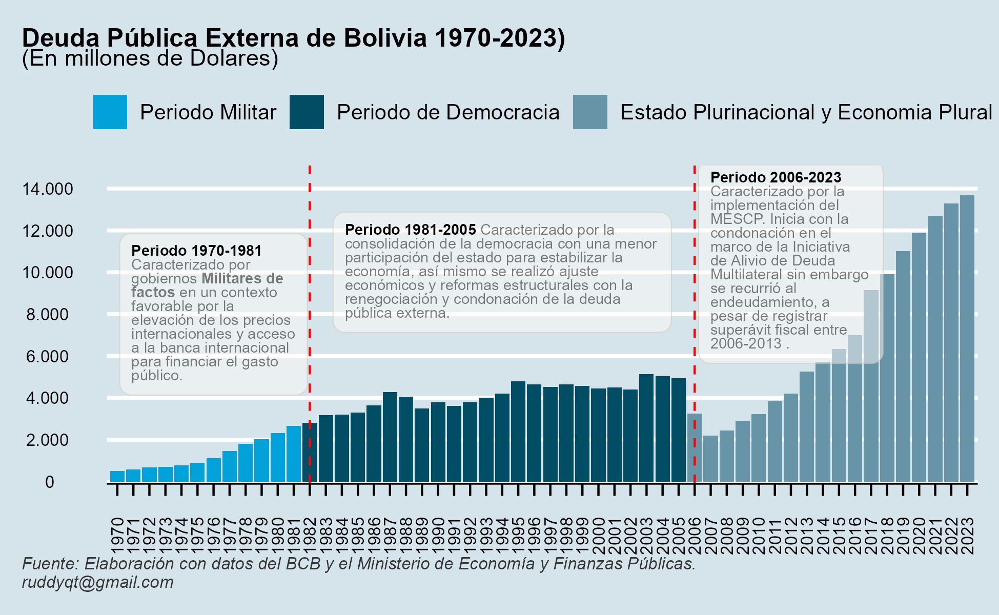

```{r setup, include=FALSE}
knitr::opts_chunk$set(echo = FALSE)
```

# Deuda Pública Externa de Bolivia

Según el [Ministerio de Economía y Finanzas Publicas](chrome-extension://efaidnbmnnnibpcajpcglclefindmkaj/https://repositorio.economiayfinanzas.gob.bo/documentos/VTCP/ECO_DEUDA_TGN.pdf) la Deuda Pública *es el dinero que el estado toma prestado de instituciones internacionales o nacionales para pagar gastos de prioridad nacional y acelerar el crecimiento*.

En ese contexto el endeudamiento público externo tiene una importancia significativa sobre las restricciones que pueda tener la economía boliviana, contraer deuda pública externa no significa obtención de fondos del exterior para poder generar crecimiento y desarrollo, el endeudamiento también implica obligaciones, es decir tener capacidad de pago.

Entre el 1970-2023 la política de endeudamiento de los diferentes gobiernos ha llevado a una situación preocupante, el déficit y el endeudamiento se tornan insostenibles, afectando a variables económicas que depende del funcionamiento real de la economía. El saldo de la deuda pública externa al 31 de diciembre de 2023, alcanzo a 13.687 millones de dólares, incrementándose en 321% entre el 2006 y 2023.



Entre 1970–2023, Bolivia atravesó por tres periodos económicos diferentes, en esa line se abordará cada periodo con la elaboración de una tabla con características como; Presidente, Partido al cual perteneció y el monto de la Deuda Pública Externa.

### - Primer Periodo 1970-1981

Este periodo fue caracterizado por gobiernos militares de facto, con una participación del estado en todas las actividades económicas, mediante el gasto público destinado a establecer las condiciones básicas para el desarrollo del sector público como también el sector privado, caracterizado en un contexto externo favorable por la elevación de los precios internacionales y acceso a la banca internacional para financiar el gasto público, incrementando de esta manera la deuda pública, entre 1970 y 1981 la deuda externa se encontraba en promedio por debajo de \$us 1.298 millones de dólares.

```{r echo=FALSE}
library(openxlsx) # Para importar / exportar excel 
library(magrittr) # Pipe
library(readxl)
library(tidyverse)   ##  (incl. the ggplot2 package)
library(systemfonts) ## fuentes personalizadas (deben estar instaladas en su sistema operativo)
library(scico)       ## c) in R 
library(ggtext)      ## agregar representación de texto mejorada a ggplot2
library(ggforce)     ## agrega funcines faltante a ggplot2
library(ggdist)      ## agregar visualizaciones de incertidumbre a ggplot2
library(magick)      ## cargar imágenes en R
library(patchwork)   ## combinar salidas de ggplot2
library(tinter)      ## tinter proporciona una forma sencilla de generar paletas monocromáticas
library(ggthemes)    ## El paquete ggthemes proporciona temas, geoms y escalas adicionales para el paquete ggplot2
library(ggcharts)    ## proporciona una interfaz de alto nivel {ggplot2}para crear gráficos comunes.
library(scales)      ##  crea guías (leyendas y ejes) que puedan usarse para leer el gráfico
library(gt)
library(gtExtras)
library(gridExtra)
library(babynames)
library(dplyr)

```

```{r echo=FALSE}
data_deuda <- read_excel("E:/01-PROYECTOS/00-1 TRABAJO DE INVESTIGACION EEB. BCB-1/data_deuda_I_Ext-2023.xlsx")
```

```{r echo=FALSE}
tab_70<- data_deuda %>% 
  select(Presidente, Año,Partido, Deuda.Externa) %>% 
  filter(Año<= "1981")
```

```{r}
tab_70 %>% 
  mutate(
    Deuda = Deuda.Externa/max(Deuda.Externa) * 100) %>% 
    mutate(Presidente= as.character(Presidente), 
    Año = as.character(Año),
    Presidente = paste0('Presidente: ', Presidente))%>% 
  gt(groupname_col = "Presidente", rowname_col = 'Año') %>% 
    fmt_number(
    columns = Deuda.Externa,
    decimals = 0,
    n_sigfig = NULL,
    use_seps = TRUE,
    pattern = "{x}",
    sep_mark = ".",
    dec_mark = ",") %>%
  gt_plt_bar_pct(
    column = Deuda,
    fill = "#4682B4",
    scaled = FALSE,
    labels = TRUE) %>% 
    #sub_zero(zero_text = '-') %>% 
    summary_rows(columns = Deuda.Externa,
                 fns = list(
                   'Maximum' = ~max(., na.rm = TRUE),
                   'Total' = ~sum(., na.rm = TRUE)),
                 fmt = ~ fmt_number(.,columns = Deuda.Externa, 
                       decimals = 2, 
                       pattern = "$us {x}",
                       sep_mark = ".",
                       dec_mark = ",",
                       use_seps = TRUE)) %>% 
  tab_options(
    data_row.padding = px(2),
    summary_row.padding = px(3), # A bit more padding for summaries
    row_group.padding = px(4)) %>%    # And even more for our groups
    opt_stylize(style = 5, color = 'gray') %>% 
    tab_header(title = md("**Primer Periodo de la Deuda Pública Externa de Bolivia 1970-1981**"),
               subtitle = md("&#9819;(En Millones de Dolares)")) %>% 
  tab_source_note(source_note = md("Fuente: Elaboración propia con base en datos del BCB y Ministerio de Economía y Finanzas Públicas.")) %>% 
  cols_label(
    Presidente          = md('**PRESIDENTE**'),
    Año                 = md('**Año**'),
    Deuda.Externa       = md('**Deuda Externa**'),
    Partido             = md('**Partido**'),
    Deuda             = md('**Deu. %**'))
```

### - Segundo Periodo 1982-2005

Este periodo es caracterizado por la consolidación de la democracia con una menor participación del estado para estabilizar la economía, así mismo se realizó ajuste económicos y reformas estructurales con la renegociación y condonación de la deuda pública externa. A diferencia del primer periodo se destaca el incremento considerable de la deuda externa llegando a registrar la gestión 2003 \$us 5.143 millones de dólares, el mas alto en todo este periodo, a partir del 2004 se revirtió la tendencia con una reducción de la deuda gracias a la renegociación y condonación de la deuda pública externa.

```{r}
tab_2005<- data_deuda %>% 
  select(Presidente, Año,Partido, Deuda.Externa) %>% 
  filter(Año > "1981" & Año < "2006")

```

```{r}
tab_2005 %>% 
  mutate(
    Deuda = Deuda.Externa/max(Deuda.Externa) * 100) %>%
  mutate(Presidente= as.character(Presidente),
       Año = as.character(Año),
       Presidente = paste0('Presidente: ', Presidente))%>%
  gt(groupname_col = "Presidente", rowname_col = 'Año') %>%
  fmt_number(
    columns = Deuda.Externa,
    decimals = 0,
    n_sigfig = NULL,
    use_seps = TRUE,
    pattern = "{x}",
    sep_mark = ".",
    dec_mark = ",") %>%
  gt_plt_bar_pct(
    column = Deuda,
    #scaled = TRUE,
    fill = "#4682B4",
    scaled = FALSE,
    labels = TRUE) %>% 
 # sub_zero(zero_text = '-') %>% 
  summary_rows(
    columns = Deuda.Externa,
    fns = list(
      'Maximum' = ~max(., na.rm = TRUE),
      'Total' = ~sum(., na.rm = TRUE)),
    fmt = ~ fmt_number(.,columns = Deuda.Externa, 
                       decimals = 2, 
                       pattern  = "$us {x}",
                       sep_mark = ".",
                       dec_mark = ",",
                       use_seps = TRUE)) %>% 
  tab_options(
    data_row.padding = px(2),
    summary_row.padding = px(3), # A bit more padding for summaries
    row_group.padding = px(4)) %>%     # And even more for our groups
    opt_stylize(style = 5, color = 'gray') %>% 
  tab_header(title = md("**Segundo Periodo de la Deuda Pública Externa de Bolivia 1982-2005**"),
             subtitle = md("&#9819; (En Millones de Dolares)")) %>%
  tab_source_note(source_note = md("Fuente: Elaboración propia con base en datos del BCB y Ministerio de Economía y Finanzas Públicas.")) %>% 
  cols_label(
    Presidente          = md('**PRESIDENTE**'),
    Año                 = md('**Año**'),
    Deuda.Externa       = md('**Deuda Externa**'),
    Partido             = md('**Partido**'),
    Deuda               = md('**Deu. %**'))

 #gtsave("tab_1.png")

```

### - Tercer Periodo 2006-2023

El 2006 Bolivia inicia con la condonación con la totalidad de los préstamos con stock al 31 de diciembre de 2003, por aproximado \$us 1.511,3 millones de dólares, en el marco de la Iniciativa de Alivio de Deuda Multilateral aproximadamente por \$us 1.744, adicionalmente se registraron condonaciones del BID y la CAF por \$us 17,8 millones de dólares. Sin embargo los gobiernos recurrieron al endeudamiento con una tendencia creciente, a pesar de registrar entre 2006-2013 superávit fiscal, es a partir del 2014 hasta 2023, se registra déficit fiscal, financiado con el incremento de la deuda pública externa, asi mismo se implemento el [Modelo Económico Social Comunitario Productivo (MESCP)](chrome-extension://efaidnbmnnnibpcajpcglclefindmkaj/https://repositorio.economiayfinanzas.gob.bo/documentos/2018/UCS/materialesElaborados/publicaciones/modelo_decima_edicion.pdf), que consiste en *atribuir al Estado un papel sumamente activo; “el Estado tiene que ser todo”, planificador, empresario, inversionista, banquero, regulador, productor del desarrollo. Pero, además, el Estado tiene la obligación de generar el crecimiento, el desarrollo en todas las instancias del país*. En este periodo Bolivia vivió de una bonanza económica gracias a los ingresos de los hidrocarburíferos (descubrimientos realizados en el primer y segundo periodo), con el agotamiento de la bonanza petrolera durante este periodo, el gobierno improvisó algunos planes para la captación de ingresos, creando empresas públicas y amplió la intervención estatal con el plan de industrialización excluyendo los sectores rentables como YPFB, sin embargo estas empresas públicas hasta la fecha son deficitarias, llegando a registrar el 2023 \$us 13.687 millones de dólares.

```{r}
tab_2023<- data_deuda %>% 
  select(Presidente, Año,Partido, Deuda.Externa) %>% 
  filter(Año > "2005")
```

```{r}
tab_2023 %>% 
  mutate(
    Deuda = Deuda.Externa/max(Deuda.Externa) * 100) %>% 
  mutate(
    Presidente= as.character(Presidente), 
    Año = as.character(Año),
    Presidente = paste0('Presidente: ', Presidente))%>% 
  gt(groupname_col = "Presidente", rowname_col = 'Año') %>% 
    fmt_number(columns = Deuda.Externa,
               decimals = 0,
               n_sigfig = NULL,
               use_seps = TRUE,
               pattern = "{x}",
               sep_mark = ".",
               dec_mark = ",") %>%
  gt_plt_bar_pct(column = Deuda,
                 fill = "#4682B4",
                 scaled = FALSE,
                 labels = TRUE) %>% 
 # sub_zero(zero_text = '-') %>% 
  summary_rows(columns = Deuda.Externa,
               fns = list(
                 'Maximum' = ~max(., na.rm = TRUE),
                 'Total' = ~sum(., na.rm = TRUE)),
               fmt = ~ fmt_number(.,columns = Deuda.Externa, 
                       decimals = 2, 
                       pattern = "$us {x}",
                       sep_mark = ".",
                       dec_mark = ",",use_seps = TRUE)) %>% 
  tab_options(data_row.padding = px(2),
               summary_row.padding = px(3), 
               row_group.padding = px(4)) %>% 
  opt_stylize(style = 5, color = 'gray') %>% 
  tab_header(
    title = md("**Tercer Periodo de la Deuda Pública Externa de Bolivia 2006-2023**"),
    subtitle = md("&#9819; (En Millones de Dolares)")) %>% 
  tab_source_note(
    source_note = md("Fuente: Elaboración propia con base en datos del BCB y Ministerio de Economía y Finanzas Públicas.")) %>% 
  cols_label(
    Presidente          = md('**PRESIDENTE**'),
    Año                 = md('**Año**'),
    Deuda.Externa       = md('**Deuda Externa**'),
    Partido             = md('**Partido**'),
    Deuda               = md('**Deu. %**'))
#%>% 
 #gtsave("tab_1.png")
```

### - Concluion

El primer periodo 1970-1981 fue caracterizado por gobiernos Militares de factos en un contexto favorable por la elevación de los precios internacionales y acceso a la banca internacional para financiar el gasto público. El segundo periodo 1981-2005 fue caracterizado por la consolidación de la democracia con una menor participación del estado para estabilizar la economía, así mismo se realizó ajustes económicos y reformas estructurales con la renegociación y condonación de la deuda pública externa, sin embargo, la tendencia fue moderadamente creciente llegando a registrar 5.142 millones de dólares el 2003 el más alto en todo el periodo. El tercer periodo 2006-2023 Bolivia inicia con la condonación con la totalidad de los préstamos en el marco de la Iniciativa de Alivio de Deuda Multilateral adicionalmente se registraron condonaciones del BID y la CAF. Sin embargo, los gobiernos recurrieron al endeudamiento con una tendencia creciente, a pesar de registrar entre 2006-2013 superávit fiscal, así mismo se implementó el [Modelo Económico Social Comunitario Productivo (MESCP)](chrome-extension://efaidnbmnnnibpcajpcglclefindmkaj/https://repositorio.economiayfinanzas.gob.bo/documentos/2018/UCS/materialesElaborados/publicaciones/modelo_decima_edicion.pdf)caracterizado por *planificador, empresario, inversionista, banquero, regulador, productor del desarrollo*, sin embargo este modelo aprovecha los descubrimientos hidrocarburíferos realizados en el primer y segundo periodo, con el agotamiento de la bonanza petrolera durante este periodo, el gobierno improvisó algunos planes para la captación de ingresos, creando empresas públicas y amplió la intervención estatal con el Plan de Industrialización excluyendo los sectores rentables como YPFB, sin embargo estas empresas públicas siguen siendo deficitarias.

```{r}
graf_1<-data_deuda%>% 
 select(Año, Deuda.Interna, Deuda.Externa ,Reservas.Internacionales) %>% 
  filter(Año >= "2000")

```

```{r}
graf_1$Deuda.Total <- rowSums(graf_1[c(2:3)] ) 
```

```{r}
 
df_long1<- graf_1 %>% 
  pivot_longer(
    cols = c("Deuda.Total", "Reservas.Internacionales"),
    names_to = "deu_res",
    values_to = "valor") %>%
  select(Año, deu_res, valor)

```

```{r}
# Area plot
 p2 <- ggplot(df_long1, aes(x = Año, y = valor)) + 
  geom_area(aes(color = deu_res, fill = deu_res), 
            alpha = 0.5, position = position_dodge(0)) +
  scale_color_manual(values = c("#00AFBB", "#E7B800")) +
  scale_fill_manual(values = c("#00AFBB", "#E7B800")) +
  scale_x_continuous(expand = c(0,0.2),breaks=pretty(df_long1$Año, n = 24),
                     name="")+
  scale_y_continuous(expand = c(0,0.1),
                     breaks = seq(0, 40000, by = 6000), 
                     limits = c(0,40000), 
                     labels=function(income) format(income,
                                                    big.mark = ".",
                                                    decimal.mark = ",",
                                                    scientific = FALSE))+
  labs(x= "Año", 
       y= "(En Millones de Dolares)",
       title = "Deuda Publica y Reservas Internacionales de Bolivia 2000-2023",
       subtitle = "(En millones de dolares)",
       caption = ("Fuente: Elaboración con datos del BCB y el Ministerio de Economía y Finanzas Públicas.\nruddyqt@gmail.com"))+
  theme_minimal(base_size = 10)+
  theme(plot.title.position =  "plot",
        axis.text.x = element_text(angle=90, vjust = 0.5),
        plot.caption.position = "plot",
        legend.position = c(0.17, 0.8),
        legend.title = element_blank(),
        legend.text = element_text(size = 10),
        plot.caption = element_text(hjust = 0,
                                    size = 8, 
                                    color = "gray21", 
                                    face = "italic"),
        axis.title.x = element_blank(),
        plot.title = element_text(size = 12,
                                  face = "bold",
                                  color = "black"))
p2
#gridExtra::grid.arrange(p1,p2,nrow=2)
```

```{r}
p3 <- ggplot(df_long1, aes(x = Año, y= valor, fill = deu_res)) +
  geom_bar(stat = 'identity',position="dodge")+
  scale_fill_manual(values = c("#36648B","#00BFFF")) +
  scale_x_continuous(expand = c(0,0.2),
                     breaks=pretty(df_long1$Año, n = 24),
                     name="")+
  scale_y_continuous(expand = c(0,0.1),
                     breaks = seq(0, 40000,
                                  by = 6000),
                     limits = c(0,40000),
                     labels = function(income) format(income,
                                                    big.mark = ".",
                                                    decimal.mark = ",",
                                                    scientific = FALSE))+
  labs(x= "Año", 
       y= "(En Millones de Dolares)",
       title = "Deuda Externa y Reservas Internacionales de Bolivia 2000-2023",
       subtitle = "(En millones de dolares)",
       caption = ("Fuente: Elaboración con datos del BCB y el Ministerio de Economía y Finanzas Públicas.\nruddyqt@gmail.com"))+
  #theme_wsj()+
  theme_minimal(base_size = 10)+
  theme(
    plot.title.position =  "plot",
    axis.text.x = element_text(angle=90, vjust = 0.5),
    legend.title = element_blank(),
    plot.caption.position = "plot",
    legend.position = c(0.17, 0.8),
    legend.text = element_text(size=10),
    plot.caption = element_text(hjust=0,size=8, 
                                color="gray21", 
                                face="italic"),
    axis.title.x = element_blank(),
    plot.title = element_text(size = 12,
                              face = "bold",
                              color = "black"))+
  geom_text(aes(label= format(valor,  big.mark = ".",
                              decimal.mark = ",", 
                              scientific = FALSE),
                color= deu_res), 
            #geom_text(aes(label = valor, color= deu_res),
            position = position_dodge(width = .9),
            angle = 90,
            hjust = -.1,
            vjust = .4,
            size = 2.8)+
  #guides(fill=guide_legend(title=NULL))+
  scale_colour_manual(values=c( "#36648B","#00BFFF"))
p3
```

```{r}
p4<-data_deuda%>% 
 select(Año,Deuda.Externa) %>%
  mutate(Etapas= case_when(Año <1982 ~"Periodo Militar",
                           Año <2006 ~"Periodo de Democracia",
                           Año >=2006 ~"Estado Plurinacional y Economia Plural"))
```

```{r}
 ggplot(p4, aes(x = Año, y= Deuda.Externa, fill= Etapas)) +
  geom_bar(stat="identity", position="dodge" )+
  geom_vline(xintercept=c(1982, 2006), 
            linetype='dashed', 
            color=c('red', 'red'))+
  scale_x_continuous(expand = c(0,0.2),
                     breaks=pretty(p4$Año, n = 54),name="Año")+
  scale_y_continuous(expand = c(0,100),
                     breaks = seq(0, 15000,by = 2000), 
                     limits = c(0,15000), 
                     labels=function(income) format(income, 
                                                    big.mark = ".",
                                                    decimal.mark = ",",
                                                    scientific = FALSE))+
  labs(x= "Año", 
       y= "(En Millones de Dolares)",
       title = "Deuda Pública Externa de Bolivia 1970-2023)",
       subtitle = "(En millones de Dolares)",
       caption = "Fuente: Elaboración con datos del BCB y el Ministerio de Economía y Finanzas Públicas.\nruddyqt@gmail.com")+
   #theme_minimal(base_size = 10)+
  #theme_light(base_size = 10)+
  #theme_solarized(base_size = 10)+
  #theme_fivethirtyeight(base_size = 10)+
  theme_economist()+ 
  scale_fill_economist(breaks=c('Periodo Militar', 
                                'Periodo de Democracia', 
                                'Estado Plurinacional y Economia Plural'))+
  #theme_wsj()+
  #scale_fill_wsj("rgby", "")+
  theme(
    plot.title.position =  "plot",
    axis.title = element_blank(),
    axis.text.x = element_text(angle=90, 
                               vjust = 0.5, 
                               size = 8),
    axis.text.y = element_text(size = 8),
    axis.ticks.length=unit(0.2,'cm'),
    plot.caption.position = "plot",
    legend.position = "top",
    legend.text = element_text(size = 10),
    plot.caption = element_text(hjust = 0, 
                                size = 8,
                                color="gray21",
                                face="italic"),
    plot.title = element_text(size = 12,
                              face = "bold",
                              color = "black"))+
  ggtext::geom_textbox(data = tibble( x=1976, y = 8000, label = "<span style='font-size:7pt;'><span style = 'color:#030303;'>**Periodo 1970-1981**</span> Caracterizado por gobiernos **Militares de factos** en un contexto favorable por la elevación de los precios internacionales y acceso a la banca internacional para financiar el gasto público.</span>"),
                       aes(x, y, label = label),
                       size = 1, family = "Montserrat",
                       fill = "#FFFAFA", alpha = 0.5, box.color = "cornsilk3",
                       width = unit(6.1, "lines"))+
  ggtext::geom_textbox(data = tibble( x=1994, y = 10000, label = "<span style='font-size:7pt;'><span style = 'color:#030303;'>**Periodo 1981-2005**</span> Caracterizado por la consolidación de la democracia con una menor participación del estado para estabilizar la economía, así mismo se realizó ajuste económicos y reformas estructurales con la renegociación y condonación de la deuda pública externa.</span>"),
                       aes(x, y, label = label),
                       size = 1, family = "Montserrat",
                       fill = "#FFFAFA", alpha = 0.5,box.color = "cornsilk3",
                       width = unit(11, "lines"))+
  ggtext::geom_textbox(data = tibble( x=2012, y = 10500, label = "<span style='font-size:7pt;'><span style = 'color:#030303;'>**Periodo 2006-2023**</span> Caracterisado por la implementacion del MESCP. Inicia con la condonacion en el marco de la Iniciativa de Alivio de Deuda Multilateral sin embargo se recurrio al endeudamiento, a pesar de registrar superávit fiscal entre 2006-2013 .</span>"),
                       aes(x, y, label = label),
                       size = 1, family = "Montserrat",
                       fill = "#FFFAFA", alpha = 0.5, box.color = "cornsilk3",
                       width = unit(6, "lines"))+
  guides(fill=guide_legend(title=NULL))
 ggsave("deuda.png")
```
